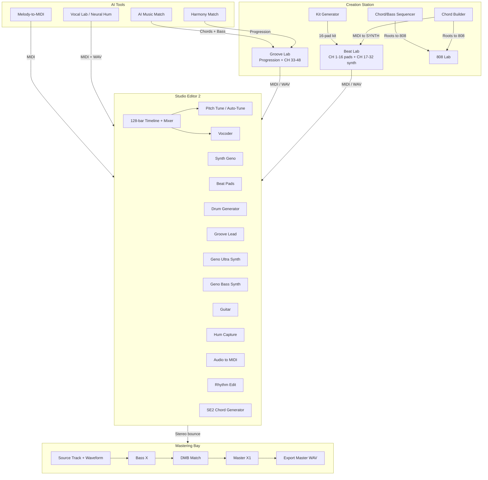

# Da Music Box — Music Production Suite
## Complete Play Store & Feature Guide

**File location:** `E:\Da-Music-Box-v4-SOURCE-COMPLETE\DA-MUSIC-BOX-PLAY-STORE-GUIDE.md`  
**Purpose:** Google Play Store listing, reviewer notes, screenshot captions, and press-kit copy.  
**Last updated:** July 4, 2026

---

## ▶ COPY THIS BLOCK — Suite Overview (click, select all, copy)

**DA MUSIC BOX — MUSIC PRODUCTION SUITE**

Da Music Box is a complete music production environment for artists, producers, and songwriters who work with real chords, groove, and song structure. Sketch beats and progressions in **Creation Station**, finish full songs in **Studio Editor 2** (the suite DAW), polish masters in **Mastering Bay**, and use AI tools — Neural Hum, Melody-to-MIDI, Harmony Match, and AI Music Match — to speed up ideas without replacing your ear.

**What's inside:** 16-pad Beat Lab with 16 dedicated synth lanes · Groove Lab progression engine · Chord Builder · 808 Lab · Kit Generator · Chord/Bass Sequencer · 128-bar Studio Editor 2 with piano roll, mixer, **per-channel Pitch Tune (auto-tune) and Vocoder**, and specialized lanes (Beat Pads, Drum Generator, Synth Geno, Groove Lead, Geno Ultra Synth, Geno Bass, Guitar, Hum Capture, Audio→MIDI, Rhythm Edit, SE2 Chord Generator) · AI Vocal Lab · AI Music Match · Mastering Bay (Bass X → DMB Match → Master X1).

**Philosophy:** Chord-theory-first workflows. AI assists — you finish. Export MIDI and WAV everywhere. One environment from first chord to final master.

---

# TABLE OF CONTENTS

1. [Mastering Bay](#1-mastering-bay)
2. [Studio Editor 2 (SE2)](#2-studio-editor-2-se2)
   - [Vocal DSP — Pitch Tune (Auto-Tune) & Vocoder](#2m-vocal-dsp--pitch-tune-auto-tune--vocoder-on-mixer-channels)
3. [Creation Station](#3-creation-station)
4. [AI Vocal Lab](#4-ai-vocal-lab)
5. [AI Music Match](#5-ai-music-match)
6. [How Everything Connects](#6-how-everything-connects)
7. [Suggested Screenshot Order](#7-suggested-screenshot-order-for-play-store)
8. [Short Play Store Feature Lines](#8-short-play-store-feature-lines)

---

# 1. MASTERING BAY

**Screenshot caption:** *Finish your mix — professional mastering rack with meters, presets, and export.*

Mastering Bay is Da Music Box's dedicated mastering workstation. Load a finished stereo mix along the bottom, process it through a three-unit rack, watch meters at the top, and export a mastered file ready for streaming, club, or radio.

## Layout

| Zone | What you see |
|------|----------------|
| **Top** | Master meters — peak, RMS, loudness-style readouts |
| **Middle** | Signal chain rack — Bass X → DMB Match → Master X1 |
| **Bottom** | Stereo source track with waveform, transport, and clip editing |
| **Side** | VU meter sidebar for detailed level monitoring |

## Signal Chain

```
In → Bass X → DMB Match → Master X1 → Out
```

Optional **De-Noise** sits in the top bar and can run **before** or **after** Master X1.

## Rack Units

### Bass X (BassOne)
Sub enhancement, drive, and tone shaping. Tabs: **Sub**, **Drive**, **Tone**. Tightens and lifts low end before the master chain.

### DMB Match (DaMatch)
Reference-style matching. Tabs: **Match**, **Ref**, **Tone**. Controls match amount, tone, dynamics, loudness, and stereo width against a reference feel.

### Master X1 (FastMaster)
Final polish: EQ, transients, compression, stereo imaging, limiting. Loudness target and optional X1 Loud boost.

## De-Noise
Broadband hiss reduction and click/pop catch. Toggle on/off and choose placement in the chain. Useful for home recordings and older samples.

## Source Clip Editing
- Load WAV/MP3 onto the source track
- **Source gain** — drag vertically on the active clip to adjust input level before the rack (Studio One–style pre-rack gain)
- Waveform shows level changes; INPUT meters reflect the adjustment in real time

## Presets
Factory **DA-MUZIK BOX** presets include:
- Club Ready · Streaming Clean · Warm Low End · Radio Loud · Trap 808 Punch · Podcast Clear
- Genre-specific masters for Hip-Hop, R&B, Pop, Trap, Lo-Fi, Electronic, and more

Save your own presets with **rename on save** — user presets appear in the main DA-MUZIK BOX list alongside factory presets.

## Export — Save New Master
Render mastered audio with metadata:
- Title, artist, album, ISRC
- Optional square cover art (JPG/PNG)
- Sample rate: 44.1 kHz or 48 kHz

**Workflow:** Load mix → pick preset or dial rack → A/B with meters → adjust source gain if needed → Save New Master.

**Screenshot ideas:**
1. Full Mastering Bay layout — meters + rack + source track
2. Bass X Sub/Drive/Tone tabs close-up
3. DMB Match reference matching panel
4. Master X1 EQ/limiter with VU sidebar
5. Save New Master modal with metadata + cover art

---

# 2. STUDIO EDITOR 2 (SE2)

**Screenshot caption:** *The suite DAW — arrange, edit, mix, and export full songs on a 128-bar timeline.*

Studio Editor 2 is the center of Da Music Box. This is where sketches from Creation Station become complete songs: arrange on a timeline, edit in the piano roll, balance in the mixer, record vocals on audio lanes, and stack specialized track types until the record is done.

## Core DAW Features
- **128-bar timeline** — MIDI + audio lanes, piano roll, mixer console
- **Transport** — Play / Pause / Stop, BPM, metronome, loop region
- **Playhead** — Vertical line on timeline and piano roll; click ruler to seek; RTZ returns to bar 1
- **Loop braces** — Constrain playback to a section for focused editing
- **BARS / TIME** readouts follow the playhead
- **Import** — MIDI, WAV, and exports from Creation Station, Vocal Lab, and other labs

---

## 2a. Audio → MIDI

**Screenshot caption:** *Drop audio — get editable MIDI notes on the piano roll.*

Add an **Audio → MIDI** track, drop an audio clip, and convert it to MIDI.

| Mode | Best for |
|------|----------|
| **Melodic** | Monophonic melody lines |
| **Bass line** | Low-end bass parts |
| **Drums** | Percussive hits |

- Works **per clip** — local pitch/rhythm analysis, not full-song stem separation
- Analyzed at session BPM, placed at the playhead
- After conversion: edit, quantize, transpose, route through mixer like any MIDI track
- Converted MIDI can also drive **Pitch Tune** or **Vocoder** pitch routing on the same lane

---

## 2b. Rhythm Edit

**Screenshot caption:** *Chord cards above the roll — control hits, beats, and rhythm without redrawing every note.*

A dedicated **Rhythm Edit** track — its own lane, not a generic MIDI add-on.

- **Chord cards** above the piano roll: chord symbol, length (¼ · ½ · 1 bar), which beats fire
- **HITS** (1×–4×) and **BEAT** (1+3, 2+4, all four…) control strikes inside a bar
- **+ Chord** or **Paste** (e.g. `C Am F G`) stacks steps on the rhythm timeline
- **▶** on a card previews one chord
- **FROM / Copy** pulls MIDI or chord steps from another lane
- **LOOP** sets how many bars **Apply to roll** paints
- **Apply to roll** chops cards into separate piano-roll hits
- **Clear notes** wipes the roll only — rhythm cards stay for re-apply

---

## 2c. SE2 Chord Generator

**Screenshot caption:** *4- or 8-bar chord sketch lane — different from Chord Builder and Progression+.*

Dedicated track from the track menu. A **4- or 8-bar chord sketch lane** — generate, edit, export harmony to the piano roll.

- Pick **length** (4/8 bars), **key** (circle-of-fifths wheel), **genre/style** presets
- Audition chord cards before export
- Optional **SE2 sync** follows main transport playhead
- Add **passing chords** per bar
- Save, rename, reload **user patterns**
- Export harmony and MIDI when ready

**Note:** Separate from **Progression+** (on instrument tracks) and **Chord Builder** in Creation Station.

---

## 2d. Progression+ (on instrument tracks)

**Screenshot caption:** *Chord timeline above the piano roll — build progressions step by step.*

Opens a **chord timeline** above the piano roll on harmony MIDI tracks.

- **LOAD ALL**, **+ ADD TO TIMELINE**, **NEXT CHORDS**
- Set loop length (4/8 bars), key, genre; preview full progression
- **Apply** paints chord MIDI on the lane
- Separate controls add **orch hits** or **Groove Lead melody** after chords exist
- Beat Pads, Drum Generator, Groove Lead, Hum Capture can **link** to Progression+ for in-key grooves

---

## 2e. Beat Pads

**Screenshot caption:** *Full drum machine inside SE2 — 16 pads, step sequencer, Pattern Bank, lane placements.*

A **full drum machine** — 16 sample pads, producer kits, pad FX, step sequencer, Pattern Bank, Lane Placements. Own track type with its own pattern, samples, kit, and mixer strip.

- **16 pads & kits** — Trap/producer folders (808s, kicks, snares, hats); **Pad FX** per pad
- **Step sequencer** — rows = pads, columns = 16th-note steps; paint hits, set loop length
- **Pattern Bank** — genre tabs (Trap, R&B, Pop, Drill, Lo-Fi…) with preset loops; **A/B** slots
- **Lane Placements** — paint kick, snare, clap, hat, rim patterns onto rows
- **Match chords** — link to Progression+, Rhythm Edit, or Synth Geno; **Load groove** fills in-key pattern; **Kick key lock** tunes 808/kick to session key
- **Sync to SE2** — Slave (SE2 drives grid) · Master (Beat Pads BPM pushes session) · Off (local loop)
- **Export loop WAV** or **Spread** pattern as MIDI/WAV to other tracks

---

## 2f. Drum Generator

**Screenshot caption:** *Producer drum grooves matched to your chords — Pop, Trap, R&B, Drill, Lo-Fi, K-pop, Dance.*

Dedicated lane on **MIDI channel 10** with producer kits.

- **Style** chips: Pop, Trap, K-pop, R&B, Dance, Drill, Lo-Fi…
- **Generate drums** from Trap/R&B/Beat Lab libraries; tiles 4-bar loop
- **Bank 2:** **Gen from chords** — Drill, Lo-Fi, Dance, K-pop grooves from linked chord lane
- **Match cards:** link Synth Geno lane + **B01/B02** build → **Generate from cards**
- **Pad sounds · 16** — swap kick, snare, clap from producer kits after picking pattern
- **Re-roll** — new variation; **Variation** slider adds ghost notes and syncopation
- **Drum pat** and **Beat Lab** load classic grids

---

## 2g. Hum Capture

**Screenshot caption:** *Hum or sing — pitches land on the melody roll and sync to the piano roll.*

Add **Hum Capture** from the track menu — MIDI lane with mic, pitch scope, melody roll (Vocal Lab technology, SE2-local).

- Hum or sing; detected pitches land on **melody roll** and sync to piano roll below
- **12 key pads** and **key lock** snap pitches to scale
- **Match chords** links to Progression+ / Rhythm Edit
- Pick instrument (piano, guitar, brass, synth…) — transport plays through lane mixer
- Melody capture only — no voice swap or RVC here (those live in AI Vocal Lab)

---

## 2h. Synth Geno

**Screenshot caption:** *Harmonic builder lane — Geno Build 1, Geno Build 2, Fusion / Note Flex.*

Dedicated **harmonic builder lane** with its own Web Audio voice — sound design, chord generation, loop composition per track.

### Geno Build 1 (Live Chord workstation)
- One-key pads, genre voicings
- **8-bar loop editor** — chords, arpeggio, bass preview before apply
- **Glide on bass** — pitch slides between bass notes
- **Glide on chords** — voice-leading between chord blocks
- Audition, then **Apply** to piano roll or audio

### Geno Build 2 (Progression loop editor)
- **4/8-bar harmonic cycles**, era/genre triggers
- Dual-keyboard input
- Apply chords + melody + bass stack
- Different from SE2 Chord Generator — full loop composition inside Synth Geno

### Fusion / Note Flex
- Self-contained plugin: **Sound** (synth patch) + **Prompt** (8-bar MIDI)
- **SpaceWalk** macros
- Three-lane roll: **Pad, Melody, Bass**
- **Sound field** — tone/filter/timbre; **Generate sound** or **Fusion** to hear changes
- **Prompt field** — keyword-driven 8-bar MIDI (pop chords and melody, R&B chords only, gospel 8 bars…) — local matching

### Lock Groove Lead
One click creates/updates a **Groove Lead ← Synth Geno** lane with lead melody locked to your Geno chord progression.

---

## 2i. Groove Lead

**Screenshot caption:** *WaveLeaf synth lead — R&B Silk, Gospel Cry, Neo Glide, and more.*

Add **Groove Lead** from the track menu — **WaveLeaf synth engine** (same family as Groove Lab) as its own channel.

- Preset banks: **R&B Silk, Gospel Cry, Neo Glide**, and more
- Macros, preview keys, per-lane filter/glide
- Draw lead melodies on piano roll (default **C5–C6**); duplicate for second lead layer
- **Chords from** links Progression+ or Rhythm Edit — **Generate melody** follows harmony
- Each lane keeps its own preset, glide, filter, output

---

## 2j. Geno Ultra Synth

**Screenshot caption:** *Grid-style subtractive synth — 3 oscillators, filter, LFOs, mod matrix, ARP with Chord Lock.*

Add **Geno Ultra Synth** — **Grid-style subtractive synth** channel (separate from Synth Geno).

- **3 oscillators**, multi-mode **filter**, amp & filter envelopes, **2 LFOs**, **8-slot mod matrix**
- Factory presets: lead, pad, bass, pluck, keys
- Built-in **ARP grid** with **Chord Lock Technology** — pick any SE2 chord lane:
  - **DETECT** — key/scale only
  - **FOLLOW** — imports progression, can regenerate arp
  - **LOCK CHORD** — keeps progression fixed while you change pattern/rate/gate
- **Preview C4** auditions patch; draw or generate on piano roll
- **SYNC SE2** optionally locks arp to main transport

---

## 2k. Geno Bass Synth (Geno Bass 52)

**Screenshot caption:** *Dedicated bass synth — 55 factory sounds, wood-grain panel, iconic bassline presets.*

Add **Geno Bass Synth** — dedicated **bass synth** channel, lighter/focused vs Geno Ultra.

- **55 factory bass sounds:** Mooga, Retro Box, FM/Digital, analog, sub/808, funk
- Warm **wood-grain hardware-style panel** — filter, amp, sub oscillator, bass keyboard
- Draw bass lines on piano roll (**C1–G3**); iconic bassline MIDI presets (R&B, electro, funk, 808 pockets)
- Same Web Audio subtractive engine as Geno Ultra, tuned for bass

---

## 2l. Guitar

**Screenshot caption:** *Sampled guitar — loops, licks, strummer, FX — R&B, Pop, Country, Funk, Blues, Rock, Latin, K-pop.*

Add **Guitar** from the track menu — sampled guitar tones, licks, loops on dedicated MIDI lane.

- **Loop player:** genre (R&B, Pop, Country, Funk, Blues, Rock, Latin, K-pop), **4 or 8 bars**, preset cards drop full part at playhead
- Neo-soul progressions, blues turnarounds, country and rock forms
- **Tabs:** Main (instrument + transpose) · **Strummer** (interactive strumming) · **Loops** (preset library) · **FX** (Drive, Chorus, Reverb)
- **Quick licks** for one-bar fills; draw your own on piano roll
- **Key convert bar** — transpose source key → target key/scale without re-drawing

---

## 2m. Vocal DSP — Pitch Tune (Auto-Tune) & Vocoder on Mixer Channels

**Screenshot caption:** *Built-in auto-tune and vocoder on every audio lane — per-channel insert FX in the SE2 mixer.*

Da Music Box includes **professional vocal processing built directly into Studio Editor 2's mixer channels**. This is not a separate plugin — **Pitch Tune (auto-tune)** and **Vocoder** live on **audio lanes and Audio→MIDI lanes** as insert effects you open from the track header or mixer strip.

### Where to find it
- Add an **audio track** (vocal recording lane) or **Audio → MIDI** lane
- Open **Vocal FX** / **Vocal DSP Suite** from the track lane header (above the piano roll and mixer strip)
- Or open **Insert FX** on the mixer channel and select **Pitch Tune DSP** or **Vocoder DSP**
- Each lane keeps its **own independent** Pitch Tune and Vocoder settings — lanes do not share one global preset

### Vocal DSP Suite panel
The floating **Vocal DSP Suite** panel gives you two power toggles side by side:

| Toggle | Label | What it does |
|--------|-------|--------------|
| **Pitch Tune DSP** | TUNE | Real-time pitch correction — mic → this track → corrected pitch → mixer |
| **Vocoder DSP** | VOC | Classic vocoder / talk-box character on the vocal |

Both include a **live pitch scope** (circular monitor) that shows detected pitch, scale targets, and correction in real time while transport plays.

---

### Pitch Tune (Auto-Tune)

**What it is:** Studio Editor 2's built-in **auto-tune / pitch correction** engine. Snaps vocal pitch to a musical scale and session key with adjustable strength — from transparent polish to hard iconic retune.

#### Character presets
| Preset | Character |
|--------|-----------|
| **Modern** | Hard snap · iconic retune |
| **Natural** | Transparent polish |
| **Iconic Hard** | Classic full retune |
| **Rap Tight** | Fast snap · talk flow |
| **R&B Melodic** | Smooth · keeps soul |
| **Vintage** | Slower pull · warm |

#### Controls
- **RETUNE** — correction strength
- **SPEED** — how fast pitch pulls to target
- **FLEX** — pitch bend flexibility
- **HUMAN** — humanize / loosen the snap
- **TRACK** — pitch tracking sensitivity
- **Scale + Key** — snap to major, minor, chromatic, and other scale options tied to the song key

#### Pitch source routing (pick ONE — they do not stack)
1. **From audio** — Pitch Tune analyzes the vocal on this lane and snaps to Scale + song key
2. **Audio → MIDI (this lane)** — drop a clip on an Audio→MIDI lane and convert; notes drive Pitch Tune
3. **MIDI from channel** — any other MIDI / rhythm lane with notes drives pitch (classic MIDI auto-tune)

**Workflow:**
1. Add audio lane · record or import vocal
2. Open Vocal DSP Suite · turn **Pitch Tune DSP** ON
3. Pick a preset (Modern, Natural, Rap Tight, etc.)
4. Set pitch route (from audio, A2M lane, or external MIDI lane)
5. Play transport — hear live correction through the mixer strip
6. Tweak RETUNE, SPEED, FLEX, HUMAN, TRACK faders to taste

**Screenshot ideas:**
- Vocal DSP Suite panel with Pitch Tune ON and pitch scope active
- Pitch Tune preset chips (Modern / Natural / Rap Tight)
- Scale + Key box and MIDI pitch route picker
- RETUNE / SPEED / FLEX fader row

---

### Vocoder

**What it is:** A full **vocoder engine** on the mixer channel — voice-driven band filtering with synth carrier. Funk talk-box, robot voice, cyber edge, warm bleed — all per lane.

#### Character presets
| Preset | Character |
|--------|-----------|
| **Robot** | Classic synth voice |
| **Transform** | Morphing machine |
| **Traditional Funk Talk Box** | Zapp-style funk talk-box |
| **Talk Box** | Guitar-driver vowels |
| **Cyber** | Sharp digital edge |
| **Warm Vox** | Softer human bleed |

#### Controls
- **WET** — vocoder blend
- **ROBOT** — synth/robot character amount
- **FORM** — formant shift (semitones)
- **ATK / REL** — attack and release of band envelope
- **NOISE** — unvoiced noise blend
- **FOCUS** — band focus / brightness
- **VIB** — vibrato depth on carrier

#### Carrier routing
- **Voice pitch** — vocoder uses this lane's vocal audio as the modulator (classic talk-box / voice-driven bands; no external MIDI carrier)
- **MIDI carrier** — pick any MIDI lane to drive the vocoder carrier synth; voice still modulates the bands

**Workflow:**
1. Add audio lane · record or import vocal
2. Open Vocal DSP Suite · turn **Vocoder DSP** ON
3. Pick a preset (Robot, Funk Talk Box, Cyber, etc.)
4. Choose **Voice pitch** or **MIDI carrier** route
5. Play transport — tweak WET, ROBOT, FORM, ATK, REL, NOISE, FOCUS, VIB
6. Record-arm the lane to see live modulator pitch on the scope while Vocoder is on

**Screenshot ideas:**
- Vocal DSP Suite with Vocoder ON and cyan pitch scope
- Vocoder preset row (Robot · Funk Talk Box · Cyber)
- Voice pitch vs MIDI carrier route chips
- WET / ROBOT / FORM fader row

---

### Mixer integration summary

```
Audio lane input
    ↓
[Insert FX slots on mixer strip]
    ├── Pitch Tune DSP  (auto-tune — scale snap, presets, MIDI route)
    ├── Vocoder DSP     (talk-box / robot — carrier + modulator)
    ├── Gate · EQ · Compressor · Reverb · Delay  (standard rack FX)
    ↓
Mixer channel fader → pan → master bus
```

- **Per-strip insert FX** — up to 3 insert slots per track; Pitch Tune and Vocoder are first-class insert effects on vocal/audio lanes
- **Live monitoring** — pitch scope tracks mic input in real time; no need to record-arm for Pitch Tune (mic routes through FX live)
- **Song key aware** — both engines respect the session key and scale for musical correction
- **Works with Audio→MIDI** — convert a vocal to MIDI on the same lane, then use those notes as the pitch source for either effect

**This is a major differentiator for Play Store:** Da Music Box ships with **built-in auto-tune and vocoder on the mixer**, not as a paid add-on or external plugin.

---

# 3. CREATION STATION

**Screenshot caption:** *Creative hub — beats, chords, bass, and groove born here, linked not isolated.*

Creation Station is where you sketch before SE2. Open from the sidebar and pick a sub-lab. Each lab has its own transport; **Session Link** can lock BPM and mirror play/stop between Beat Lab, Groove Lab, 808 Lab, and Chord Builder.

**Sub-nav:** Beat Lab · Groove Lab · Chord Builder · 808 Lab · Kit Generator · Chord/Bass Sequencer

---

## 3a. Beat Lab

**Tagline:** *Sixteen pads. Sixteen synth lanes. One locked transport.*

- **CH 1–16:** Drum/sample pads, 16-step grid, per-pad FX, mixer strips
- **CH 17–32 (NEW SYNTH):** Dedicated melodic synth lanes — own piano rolls, voice engines, mixer strips (separate from drum pads)
- **Pattern Bank:** Trap, R&B, Disco, House, Afro, Reggae, and more — drum grids + recommended BPM + crew kits
- **Crew Kits & Sound Families:** Producer-ready 16-pad mappings; bundled 808s, kicks, snares, subs
- **Banks A–H** for pad kits; **Pattern slots A & B** for two drum patterns
- **Views:** GRID STD · GRID FULL · **ROLL** / **SYNTH** (melodic piano rolls)
- **Export:** MIDI to Studio Editor 2, WAV/MIDI, bounce to pads, import chords from Chord Builder or Groove Lab

---

## 3b. Groove Lab

**Tagline:** *Progression-first harmony for producers who think in changes.*

- **Progression** panel — flagship workflow
- **Genre packs** (R&B, Gospel, Reggae, Pop, 100+ loops): audition, **8-bar song sketch**, stack on **Your Timeline**, **DROP TO PIANO ROLL**
- **Rhythm Edit Box:** Chop one chord into multiple hits per bar (reggae skips, stabs, phased chops)
- **Orchid chord strip:** Scale-aware chord typing, SMART MATCH, chord-to-grid placement
- **CH 33–48:** Assign CHORD · GUITAR · GROOVE LEAD · SAMPLE — 16-channel mixer
- **Guitar pack** and **Orchestra hit** panels
- **MATCH BASS** follows chord roots when dropping progressions
- **Export:** Timeline MIDI/WAV, send to NEW SYNTH; Harmony Match and AI Music Match load progressions here

---

## 3c. Chord Builder

**Tagline:** *Theory-aware harmony that feeds the rest of the station.*

- **KEY + MODE + GENRE** — pads and presets follow scale
- **Chord scale pads** (I, ii, V…); click to audition, double-click to timeline, drag onto piano-roll bars
- **Progression tabs**; **AUTO-GENERATE SONG** (Intro · Pre-Chorus · Chorus · Bridge · Outro)
- **CHORD PROGRESSIONS** + **PROFESSIONAL CHORD PROGRESSIONS** library
- **SMART VOICINGS**, arpeggiator, delay/FX, multiple preview voices
- **Melody Match (inside Chord Builder):** Hum, upload audio, or live voice-MIDI → suggests progressions → apply to active tab

**Exports:**

| Action | Destination |
|--------|-------------|
| Save MIDI | Download `.mid` |
| MIDI → SYNTH | Beat Lab SYNTH lanes (CH 17–32) |
| WAV → Pad | Bounce to Beat Lab sampler pad (1–16) |
| Roots → 808 | Chord roots to 808 Lab |
| SONG cluster | All progression tabs back-to-back |

---

## 3d. 808 Lab

**Tagline:** *Trap sub-bass and MPC-style rolls — locked to your groove.*

**808 Kick / Bass**
- 16 chromatic tone pads; kick/bass piano roll
- Trap/bass presets, octave shift, HP/LP filters

**Drum kits**
- MPC-style one-shot pads + 16-lane step grid (16th-note steps)

**Chord Lock (flagship)**
- **CHORD LOCK** → source: **CB** (Chord Builder), **GL** (Groove Lab), or **NS** (Beat Lab NEW SYNTH)
- **GENERATE ROOTS** — bass root hits in progression order
- **+ CHORDS** optionally layers full harmony under 808

**Sync:** 808 LINK · BPM → (808 / Beat Lab / Groove Lab / Chord Builder) · PLAY → mirror transport · Session Link slaves to Beat Lab

**Export:** MIDI / WAV / **To Pad** (Beat Lab sampler 1–16)

---

## 3e. Kit Generator → Beat Lab

**Tagline:** *Procedural drum kits — browser-only, no network.*

Opens modal inside Beat Lab. Procedural one-shots and starter grooves load directly onto active pad bank.

- **Styles:** House, Trap, Lo-fi, R&B, Dance, Disco
- **Generate sound** — one pad
- **Generate full kit (16 pads)**
- **Generate starter pattern only**
- **Generate full kit + pattern**

Also: import external/bundled folder kits (Lex/trap/crew) through normal kit browser.

---

## 3f. Chord / Bass Sequencer

**Tagline:** *Step sequenced harmony and bass for grid-first producers.*

Straight chord step sequencer — not Groove Lab's progression UI, not Beat Lab pads. **STEPS** row (4–32 steps) left to right; each step holds one chord. Bass auto-locked to chord steps.

**Chord:** KEY + mode + GENRE · chord pads · CHORD PROGRESSIONS · SUGGEST · LOAD CUSTOM · Orchid voicing panel

**Bass (auto-locked):**
- **VOICE:** SUB · ELEC · PLUCK
- **ANCHOR:** POCKET, 808 SUB, POP 4, PUSH, REGGAE, HALF-TIME…
- **MOTION:** WALKING, MOTOWN, GOSPEL, funk ghosts, arps
- **FEEL:** FIFTH, SYNCOPATED, DOTTED, DISCO
- **SWING · LENGTH · SLIDE · FILLS** · **AUTO-WRITE**
- **Bass slot bank A–H**; per-step slot chips (Verse vs Chorus)

**Export:** WAV · MIDI (chords ch1, bass ch2) · PAD · ROOTS → 808 · MIDI OUT (loopMIDI / IAC)

---

# 4. AI VOCAL LAB

**Screenshot caption:** *Hum-to-MIDI · voice tools · enhancement — AI assists, you finish.*

Sidebar module with sub-nav: **Vocal Lab** · **Melody-to-MIDI** · **Harmony**

---

## 4a. Vocal Lab (Neural Hum)

- **Neural Hum** — hum or sing → editable melody roll → render & export
- **RVC Singing Converter**
- **Voice Swap** (uses Hum Capture recording)
- **Enhancement Suite**
- **Vocal Tracks** panel

**Neural Hum workflow:**
1. Hum/sing — **pitch scope** tracks live; or upload vocal clip
2. **Key lock** (Auto / Off / scale pick)
3. **Melody roll** (4 or 8 bars): paint, drag, resize; quantize matches BPM
4. Mini keyboard + drum pads — arm pad note, hum it in during take
5. Pick instrument → **Render** → A/B Hum vs Instrument

**Export:** WAV / MP3 → Studio Editor 2, Groove Lab, Beat Lab NEW SYNTH

---

## 4b. Melody-to-MIDI

**Header:** *Capture or upload audio*

Monophonic audio → MIDI with transposition, tempo scaling, quantization. Best for single-note lines.

1. **Start Recording** or **Upload Audio**
2. Monitor: waveform + level
3. **Transposition** (±12), **Tempo scale**, **Quantize** (1/4, 1/8, 1/16), **Confidence**
4. **Transcribe to MIDI** → piano roll for hand editing
5. **Pattern length** (1–16 bars) → Export to Studio Editor or download `.mid`

---

## 4c. Harmony Match

**Header:** *Hum or upload a melody → pick a progression → open in Groove Lab*

**Capture:** HUM · FILE · LIVE (real-time voice MIDI; 8+ notes recommended)

1. Capture melody
2. Tap **MATCH** — numbered candidate chips
3. Click candidate → chords load into **Groove Lab**
4. Edit green chord roll; **MATCH BASS** for bass line

**Tip:** Clear single-note melody, 4–8 bars, steady tempo, quiet room.

*(Separate from Chord Builder's internal Melody Match — this screen sends to Groove Lab.)*

---

# 5. AI MUSIC MATCH

**Screenshot caption:** *Vocal stem in → key detect → chord roll + bass → Studio Editor 2 or Groove Lab.*

**Tagline:** *Vocal stem in, matched chords + bass out.*

Upload vocal or melody stem. Detects key, suggests chord progressions and matching bass — **chords + bass only, no drums**. **100% offline** (rule-based harmonic matching).

**Workflow:**
1. **Upload stem** — WAV/MP3 (vocal, melody, bass, or full mix). Acapellas work best.
2. **Based on Music Match** — Vocals · Instruments · Bass · Full mix
3. **Genre** (Hip-Hop, R&B, Pop, Trap, Lo-Fi, Electronic, Jazz, Rock, Soul, Afrobeats) + **Mood** (Chill, Hype, Dark, Romantic, Uplifting, Melancholic, Aggressive, Dreamy)
4. Run match → up to 6 candidates in Geno Build-style roll (vocals on top, chords + bass below, 4–8 bars)
5. **Preview** stem against matched chords + bass
6. **One tap → Groove Lab** or **Send to Studio Editor 2**

Uses first ~45 seconds of longer clips; needs ~8+ pitch frames; cleaner vocal stems = better matches.

---

# 6. HOW EVERYTHING CONNECTS

## Suite routing diagram



## Cross-module connection table

| From | To | How |
|------|-----|-----|
| Chord Builder | Beat Lab NEW SYNTH | MIDI → SYNTH |
| Chord Builder | 808 Lab | Roots → 808 |
| Chord Builder | Beat Lab pad | WAV → Pad |
| Groove Lab | Beat Lab NEW SYNTH | Send to NEW SYNTH |
| Harmony Match / AI Music Match | Groove Lab | Load matched progression |
| Neural Hum / Vocal Lab | SE2, Groove Lab, NEW SYNTH | Export buttons |
| Chord/Bass Sequencer | 808 Lab | ROOTS → 808 (optional) |
| Audio → MIDI lane | Pitch Tune / Vocoder | MIDI pitch route on same lane |
| Any Creation lab | Studio Editor 2 | MIDI/WAV export |
| Studio Editor 2 | Mastering Bay | Bounce stereo mix → master |
| Session Link | Linked labs | Beat Lab BPM master; optional play mirror |

## Typical producer workflows

### Workflow A — Beat first
```
Beat Lab (drums + synth) → Chord Builder (harmony) → 808 Lab (sub) → SE2 (arrange + vocal + auto-tune) → Mastering Bay
```

### Workflow B — Progression first
```
Groove Lab (progression) → Beat Lab (drums) → SE2 (Groove Lead + Drum Generator) → Mastering Bay
```

### Workflow C — Vocal first
```
AI Music Match or Harmony Match → Groove Lab (chords + bass) → Beat Lab (drums) → SE2 (vocal lane + Pitch Tune + Vocoder) → Mastering Bay
```

### Workflow D — Hum to finished song
```
Vocal Lab (Neural Hum) → SE2 (arrange + Hum Capture lane) → Groove Lab (harmony match) → Mastering Bay
```

---

# 7. SUGGESTED SCREENSHOT ORDER FOR PLAY STORE

Use this order so reviewers and users see the full story. Pair each screenshot with the caption from the section above.

| # | Screen | Caption focus |
|---|--------|---------------|
| 1 | Sidebar / Welcome | Full suite overview — all modules visible |
| 2 | **Mastering Bay** | Rack + meters + source track + VU sidebar |
| 3 | Mastering Bay | Save New Master modal with metadata |
| 4 | **Studio Editor 2** | Full 128-bar timeline arrange view |
| 5 | SE2 Mixer | **Vocal DSP Suite — Pitch Tune + Vocoder on channel** |
| 6 | SE2 | Pitch Tune scope + Modern preset active |
| 7 | SE2 | Vocoder Funk Talk Box preset + faders |
| 8 | SE2 | Synth Geno — Geno Build 1 loop editor |
| 9 | SE2 | Beat Pads — step sequencer + Pattern Bank |
| 10 | SE2 | Drum Generator matched to chords |
| 11 | SE2 | Groove Lead + Geno Ultra Synth lanes |
| 12 | SE2 | Guitar loop player + strummer |
| 13 | **Groove Lab** | Progression panel + timeline |
| 14 | **Beat Lab** | 16 pads + NEW SYNTH lanes (CH 17–32) |
| 15 | **Chord Builder** | Scale pads + progression tabs |
| 16 | **808 Lab** | Chord Lock + kick/bass roll |
| 17 | Chord/Bass Sequencer | Step grid + bass piano roll |
| 18 | Kit Generator | Generate full kit modal |
| 19 | **AI Vocal Lab** | Neural Hum pitch scope |
| 20 | Melody-to-MIDI | Transcription piano roll |
| 21 | **AI Music Match** | Stem upload + matched chord roll |
| 22 | Harmony Match | Match candidates → Groove Lab |

---

# 8. SHORT PLAY STORE FEATURE LINES

*Under 80 characters each — for bullet lists and store metadata.*

- Mastering Bay: Bass X → DMB Match → Master X1 · presets · export
- Studio Editor 2: 128-bar DAW · piano roll · mixer · vocal FX
- Built-in auto-tune + vocoder on every audio mixer channel
- Beat Lab: 16 pads + 16 synth lanes · Pattern Bank · metronome-locked
- Groove Lab: 100+ genre progressions · 8-bar sketch · MATCH BASS
- Synth Geno: Live chords · progression loops · Fusion Note Flex
- AI Music Match: Vocal stem → matched chords + bass · offline
- Neural Hum: Sing → MIDI → Studio Editor 2
- 808 Lab: Trap sub-bass · Chord Lock · MPC drum grid
- Chord Builder: Theory-aware harmony · export to Beat Lab & 808

---

# NOT INCLUDED (INTENTIONALLY)

**AI Song Generator** — placeholder only; new engine in development. Not documented for store listing until ready.

---

# NAVIGATION CHEAT SHEET

| User-facing name | Where to find it |
|------------------|------------------|
| Mastering Bay | Sidebar (top-level) |
| Studio Editor 2 | Sidebar (top-level) |
| Pitch Tune / Auto-Tune | SE2 → audio lane → Vocal FX / Insert FX |
| Vocoder | SE2 → audio lane → Vocal FX / Insert FX |
| Beat Lab | Creation Station → Beat Lab |
| Groove Lab | Creation Station → Groove Lab |
| Chord Builder | Creation Station → Chord |
| 808 Lab | Creation Station → 808 |
| Kit Generator | Creation Station → Kit Generator → Beat Lab |
| Chord / Bass Sequencer | Creation Station → Chord/Bass |
| AI Vocal Lab | Sidebar (parent module) |
| Vocal Lab | AI Vocal Lab → Vocal Lab |
| Melody-to-MIDI | AI Vocal Lab → Melody-to-MIDI |
| Harmony Match | AI Vocal Lab → Harmony |
| AI Music Match | Sidebar (top-level) |

---

*Da Music Box — Real harmony. Real production. AI when you want it — never instead of your ear.*
